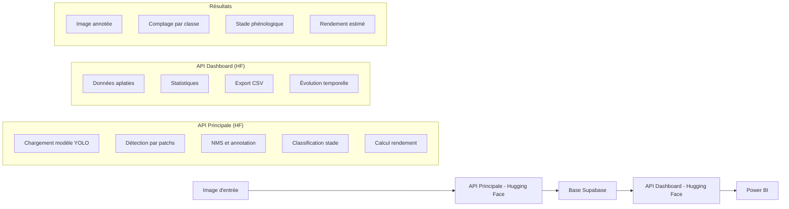

# 🚀 5 - Déploiement du Système

Cette section documente l'étape de déploiement de notre solution complète de détection phénologique des orangers, suivant la méthodologie MLOps.

## 5.1 - Vue d'ensemble du projet

Notre système implémente une solution de vision par ordinateur pour détecter et classifier les différents stades phénologiques des orangers (floraison, grossissement, maturation), permettant ainsi d'estimer le rendement potentiel et de suivre l'évolution temporelle des cultures. Le système utilise un modèle YOLOv8 personnalisé entraîné pour détecter les différents stades de développement des oranges.

## 5.2 - Architecture du système déployé

### 📊 Composants principaux

- **Modèle de détection** : YOLOv8 personnalisé (`last32.pt`)
- **API principale** : FastAPI pour la détection et prédiction (déployée sur Hugging Face)
- **API dashboard** : FastAPI pour l'exposition des données analytiques (déployée sur Hugging Face)
- **Base de données** : Supabase pour le stockage persistant
- **Traitement d'image** : OpenCV, PyTorch, Ultralytics
- **Visualisation** : Intégration Power BI via endpoints dédiés

### 🔄 Diagramme de l'architecture



## 5.3 - Modèle ML déployé

### 🧠 Caractéristiques du modèle

- **Architecture** : YOLOv8
- **Fichier de poids** : `last32.pt`
- **Classes détectées** : 
  - `flower` : Fleurs ouvertes
  - `flower Fermee` : Fleurs fermées
  - `green` : Fruits verts (grossissement)
  - `mature` : Fruits mûrs
  - `noisant` : Stade noisant
- **Seuil de confiance** : 0.35

### 🔍 Stratégie de détection

Le modèle implémente une approche de "détection par patchs" optimisée :
- Découpage de l'image en zones de 800×800 pixels avec stride de 400
- Traitement par lots des patchs (batch_size=8)
- Application de NMS avec un seuil IoU de 0.5
- Filtrage des grandes détections (max_box_size=220)

<div style={{ display: "flex", justifyContent: "space-around", alignItems: "center", flexWrap: "wrap" }}>
  <div style={{ textAlign: "center", width: "85%" }}>
    
    <p><strong>Approche par patchs</strong></p>
  </div>
 
</div>

## 5.4 - API Principale (Hugging Face)

### 🌐 Points de terminaison

|         Endpoint        |   Méthode   |                    Description                              |
|-------------------------|-------------|-------------------------------------------------------------|
| `/`                     |   GET       |    Page d'accueil confirmant que l'API est opérationnelle   |
| `/predict`              |   POST      |    Endpoint principal pour l'analyse d'images               |
| `/get_image/{filename}` |   GET       |    Récupération des images de résultats annotées            |
| `/dashboard/stades_flat`|   GET       |    Données aplaties pour visualisations                     |
| `/export/csv`           |   GET       |    Export CSV des données d'analyse                         |

### ⚙️ Workflow de l'API principale

1. **Réception d'image** : L'API reçoit une image via un formulaire multipart avec ID d'arbre optionnel
2. **Prétraitement** : Sauvegarde temporaire et chargement avec OpenCV
3. **Détection par patchs** : Application du modèle YOLO sur l'image découpée
4. **Post-traitement** : 
   - Application de NMS pour éliminer les détections redondantes
   - Annotation de l'image avec bounding boxes colorées
   - Comptage des objets par classe
5. **Classification du stade** : Détermination du stade phénologique dominant
6. **Calcul du rendement** : Estimation basée sur les fruits détectés
7. **Sauvegarde** : Stockage des détections et métadonnées dans Supabase
8. **Réponse** : Retour d'un JSON complet avec toutes les informations

### 📝 Format de réponse de l'API principale

```json
{
    "image_url": "https://[huggingface-url]/get_image/abc123.jpg",
    "class_counts": {
        "flower": 15,
        "flower Fermee": 8,
        "green": 25,
        "mature": 12,
        "noisant": 3
    },
    "stade": "Grossissement",
    "stade_id": "uuid-123",
    "rendement_estime_kg": 12.4
}
```

## 5.5 - API Dashboard (Hugging Face)

### 🌐 Points de terminaison analytiques

|         Endpoint                    |   Méthode   |                    Description                              |
|-------------------------------------|-------------|-------------------------------------------------------------|
| `/`                                 |   GET       |    Page d'accueil de l'API dashboard                        |
| `/dashboard/stades_flat`            |   GET       |    Données aplaties pour Power BI                           |
| `/export/csv`                       |   GET       |    Export CSV avec headers de disposition                    |
| `/dashboard/stats`                  |   GET       |    Statistiques générales du système                        |
| `/dashboard/rendement_par_arbre`    |   GET       |    Rendement détaillé par arbre                             |
| `/dashboard/evolution_temporelle`   |   GET       |    Évolution temporelle des stades                          |

### ⚙️ Workflow de l'API dashboard

1. **Récupération des données** : Extraction depuis Supabase avec tri temporel
2. **Transformation** : Aplatissement des données JSON pour analyse
3. **Agrégation** : Calculs statistiques et regroupements
4. **Format d'export** : Adaptation pour Power BI et exports CSV

### 📊 Exemples de réponses analytiques

#### Données aplaties
```json
{
    "success": true,
    "data": [
        {
            "arbre_id": "ARBRE001",
            "date": "2024-01-15",
            "stade": "Floraison",
            "class": "flower",
            "count": 15,
            "total_detections": 45,
            "rendement_estime_kg": 8.5
        }
    ]
}
```

#### Statistiques générales
```json
{
    "success": true,
    "stats": {
        "total_analyses": 156,
        "arbres_uniques": 12,
        "total_rendement_kg": 145.8,
        "repartition_classes": {
            "flower": 245,
            "green": 189,
            "mature": 67
        }
    }
}
```

## 5.6 - Base de données Supabase

### 🗄️ Structure des tables

#### Table `detection`
- `id` : UUID unique
- `jour` : Date de détection
- `classe` : Classe détectée (flower, green, etc.)
- `bbox` : Coordonnées JSON de la bounding box
- `surface` : Surface de la détection
- `confiance` : Score de confiance du modèle
- `id_image` : Identifiant de l'image
- `tracking_id` : ID de suivi (optionnel)

#### Table `stade`
- `id` : UUID unique
- `arbre_id` : Identifiant de l'arbre
- `date` : Date d'analyse
- `stade` : Stade phénologique dominant
- `class_counts` : Comptage JSON par classe
- `total_detections` : Nombre total de détections
- `image_id` : Identifiant de l'image analysée
- `timestamp` : Horodatage complet
- `rendement_estime_kg` : Rendement estimé en kg

## 5.7 - Logique de classification des stades

### 🌱 Algorithme de détermination du stade

```python
# Logique de classification
flower_total = class_counts.get("flower", 0) + class_counts.get("flower Fermee", 0)
green = class_counts.get("green", 0)
mature = class_counts.get("mature", 0)
noisant = class_counts.get("noisant", 0)

max_count = max(flower_total, green, mature, noisant)

if max_count == flower_total:
    stade = "Floraison"
elif max_count == green:
    stade = "Grossissement"
elif max_count == mature:
    stade = "Maturation"
elif max_count == noisant:
    stade = "Stade Noisant"
else:
    stade = "Aucun"
```

### 📈 Calcul du rendement

```python
def calculer_rendement(class_counts):
    green = class_counts.get("green", 0)
    mature = class_counts.get("mature", 0)
    return (green + mature) * 0.2  # Coefficient de conversion
```

## 5.8 - Optimisations techniques

### 🔄 Traitement par patchs optimisé

```python
def predict_on_patches(model, image, patch_size=800, stride=400, 
                      conf_threshold=0.35, max_box_size=220, batch_size=8):
    # Découpage intelligent avec padding
    # Traitement par lots pour optimiser les performances
    # Filtrage des détections aberrantes
```

### 🎯 Post-traitement avancé

- **NMS adaptatif** : Seuil IoU de 0.5 pour éliminer les doublons
- **Filtrage spatial** : Élimination des détections trop grandes
- **Codage couleur** : Attribution de couleurs fixes par classe pour cohérence visuelle

### 💾 Gestion des données

- **Sauvegarde atomique** : Transactions Supabase pour cohérence des données
- **Métadonnées enrichies** : Stockage des informations contextuelles
- **Indexation temporelle** : Optimisation des requêtes par date

## 5.9 - Déploiement sur Hugging Face

### 🚀 Configuration du déploiement Hugging Face

#### Structure du projet pour Hugging Face Spaces
```
phenology-detection-system/
├── app.py                 # API principale
├── dashboard.py           # API dashboard
├── requirements.txt       # Dépendances Python
├── last32.pt             # Modèle YOLO
├── .env                  # Variables d'environnement
└── README.md             # Documentation du Space
```

#### Fichier `requirements.txt` pour Hugging Face
```txt


fastapi
uvicorn
python-multipart
numpy
opencv-python-headless
torch
torchvision
ultralytics==8.3.123  
pymongo
supabase

```


### 🔧 Avantages du déploiement Hugging Face

- **Simplicité** : Déploiement direct depuis le repository
- **Scalabilité** : Gestion automatique de la charge
- **Disponibilité** : Haute disponibilité garantie
- **Intégration** : Interface utilisateur automatique via Gradio
- **Monitoring** : Logs et métriques intégrés
- **Sécurité** : Gestion sécurisée des secrets

### 📱 URLs de déploiement

```bash
# API Principale
https://fatimabelgazem-stadephenoaf.hf.space

# API Dashboard
https://fatimabelgazem-dashboardsf.hf.space
```


Le système est maintenant déployé sur **Hugging Face Spaces** avec une architecture cloud robuste permettant le suivi en temps réel de l'évolution phénologique des orangers avec une haute disponibilité et une scalabilité automatique.