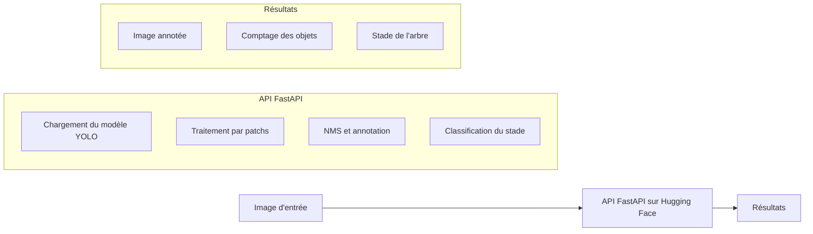

# 🚀 4 - Déploiement du Modèle

Cette section documente l'étape de déploiement de notre solution de détection d'objets pour les orangers, suivant la méthodologie MLOps.

## 4.1 - Vue d'ensemble du projet

Notre système implémente une solution de vision par ordinateur pour détecter les oranges et évaluer le stade de développement des orangers, permettant ainsi d'estimer le rendement potentiel. Le système utilise un modèle YOLOv8 entraîné pour détecter différents stades de croissance des oranges et des arbres.

## 4.2 - Architecture du système déployé

### 📊 Composants principaux

- **Modèle de détection** : YOLOv8 personnalisé (`best.pt`)
- **API de service** : FastAPI
- **Plateforme de déploiement** : Hugging Face Spaces
- **Traitement d'image** : OpenCV, PyTorch
- **Logique métier** : Détection par patchs et post-traitement

### 🔄 Diagramme de l'architecture



## 4.3 - Modèle ML déployé

### 🧠 Caractéristiques du modèle

- **Architecture** : YOLOv8
- **Fichier de poids** : `best.pt`
- **Classes détectées** : Diverses phases/objets liés aux orangers (selon `model.names`)
- **Seuil de confiance** : 0.15

### 🔍 Stratégie de détection

Le modèle implémente une approche de "détection par patchs" pour traiter efficacement des images de grande taille :
- Découpage de l'image en zones de 600×600 pixels
- Traitement par lots des patchs (batch_size=8)
- Application de NMS (Non-Maximum Suppression) avec un seuil IoU de 0.5
- Filtrage des grandes détections (max_box_size=100)

## 4.4 - API FastAPI

### 🌐 Points de terminaison

| Endpoint | Méthode | Description |
|----------|---------|-------------|
| `/` | GET | Page d'accueil confirmant que l'API est opérationnelle |
| `/predict` | POST | Endpoint principal pour l'analyse d'images |
| `/get_image/{filename}` | GET | Récupération des images de résultats annotées |

### ⚙️ Workflow de l'API

1. **Réception d'image** : L'API reçoit une image via un formulaire multipart
2. **Prétraitement** : Sauvegarde temporaire et chargement avec OpenCV
3. **Détection** : Application du modèle YOLO par patchs sur l'image
4. **Post-traitement** : 
   - Application de NMS pour éliminer les détections redondantes
   - Annotation de l'image avec les bounding boxes et étiquettes
   - Comptage des objets par classe
5. **Détermination du stade** : Analyse de la classe prédominante pour déterminer le stade de développement
6. **Réponse** : Retour d'un JSON contenant l'URL de l'image annotée, le décompte des classes et le stade identifié

### 📝 Format de réponse

```json
{
    "image_url": "https://[base_url]/get_image/output_result.jpg",
    "class_counts": {
        "flower": 10,
        "green": 5,
        "mature": 0
    }
}
```

## 4.5 - Déploiement sur Hugging Face Spaces

### 🛠️ Configuration du déploiement

- **Type d'environnement** : Docker (CPU)
- **Dépendances** : PyTorch, OpenCV, Ultralytics, FastAPI
- **Stockage temporaire** : Utilisation du répertoire `/tmp` pour les fichiers temporaires
- **Sécurité** : L'API valide les formats d'image et gère les exceptions

### 📂 Fichiers requis pour le déploiement

- `app.py` : Le code de l'API FastAPI
- `best.pt` : Le fichier de poids du modèle entraîné
- `requirements.txt` : Liste des dépendances Python
- `Dockerfile` : (Optionnel) Configuration Docker personnalisée

## 4.6 - Optimisations techniques

### 🔄 Traitement par patchs

La méthode `predict_on_patches` découpe l'image en segments pour:
- Gérer efficacement les images de haute résolution
- Améliorer la détection de petits objets
- Optimiser l'utilisation de la mémoire

```python
# Extrait de code clé
def predict_on_patches(model, image, patch_size=600, stride=600, 
                      conf_threshold=0.15, max_box_size=100, batch_size=8):
    # ...découpage et traitement par lots...
```

### 🎯 Filtrage et NMS

Élimination des détections redondantes:
- Application de NMS (Non-Maximum Suppression) avec PyTorch
- Filtrage des grandes détections pour éliminer les faux positifs

```python
# Extrait de code clé
keep_indices = nms(boxes_tensor, scores_tensor, iou_threshold=iou_threshold)
```

### 💾 Gestion de la mémoire

- Traitement par lots (`batch_size=8`) pour optimiser l'utilisation GPU/CPU
- Utilisation de fichiers temporaires pour limiter l'utilisation de la mémoire

## 4.7 - Considérations de mise en production

### ⚡ Performances

- **Temps de traitement** : Variable selon la taille de l'image et le nombre de détections
- **Consommation de ressources** : Principalement limitée par la mémoire disponible pour le traitement des grands patchs

### ⚠️ Limites actuelles

- Temps de traitement potentiellement long pour les très grandes images
- Dépendance à un stockage temporaire pour les fichiers intermédiaires
- Utilisation de CPU pour l'inférence (possibilité d'optimisation GPU)

### 🔧 Recommandations d'évolution

- **Mise en cache des résultats** : Implémentation d'un système de cache pour les requêtes répétées
- **Parallélisation** : Distribution du traitement des patchs sur plusieurs cœurs/machines
- **Optimisation du modèle** : Quantification ou distillation pour réduire la taille du modèle
- **Système de file d'attente** : Implémentation d'un système de queue pour gérer les requêtes simultanées

## 4.8 - Surveillance et maintenance

### 📊 Métriques de surveillance

- **Taux de succès des prédictions** : Ratio de prédictions réussies
- **Temps de réponse de l'API** : Latence moyenne par requête
- **Utilisation des ressources** : CPU, mémoire, stockage

### 🔄 Plan de maintenance

- **Mise à jour du modèle** : Procédure pour déployer de nouvelles versions du modèle
- **Sauvegarde** : Plan de sauvegarde des modèles et configurations
- **Validation** : Tests automatisés pour valider les mises à jour

## 4.9 - Guide d'utilisation

### 🖥️ Exemple de requête avec cURL

```bash
curl -X POST "https://[votre-espace-huggingface]/predict" \
     -F "file=@chemin/vers/image_oranger.jpg"
```

### 🐍 Exemple de requête avec Python

```python
import requests

url = "https://[votre-espace-huggingface]/predict"
files = {"file": open("chemin/vers/image_oranger.jpg", "rb")}
response = requests.post(url, files=files)
result = response.json()

print(f"Stade de l'arbre: {result['stade']}")
print(f"Comptage des objets: {result['class_counts']}")
print(f"URL de l'image annotée: {result['image_url']}")
```

### 🌐 Intégration dans une application web

Le système peut être intégré dans une interface utilisateur web en:
- Envoyant des images via des requêtes POST
- Affichant l'image annotée retournée
- Présentant les statistiques de comptage et le stade dans un tableau de bord

## 4.10 - Résumé du déploiement

|      Étape               |        Action réalisée                                   |
|--------------------------|---------------------------------------------------|
|  Modèle                  |  YOLOv8 fine-tuné sur notre dataset d'orangers    |
|  API                     |  FastAPI pour l'exposition des fonctionnalités     |
|  Optimisation            |  Détection par patchs et traitement par lots       |
|  Plateforme              |  Hugging Face Spaces avec Docker                   |
|  Résultat                |  API REST déployée et accessible via internet      |
